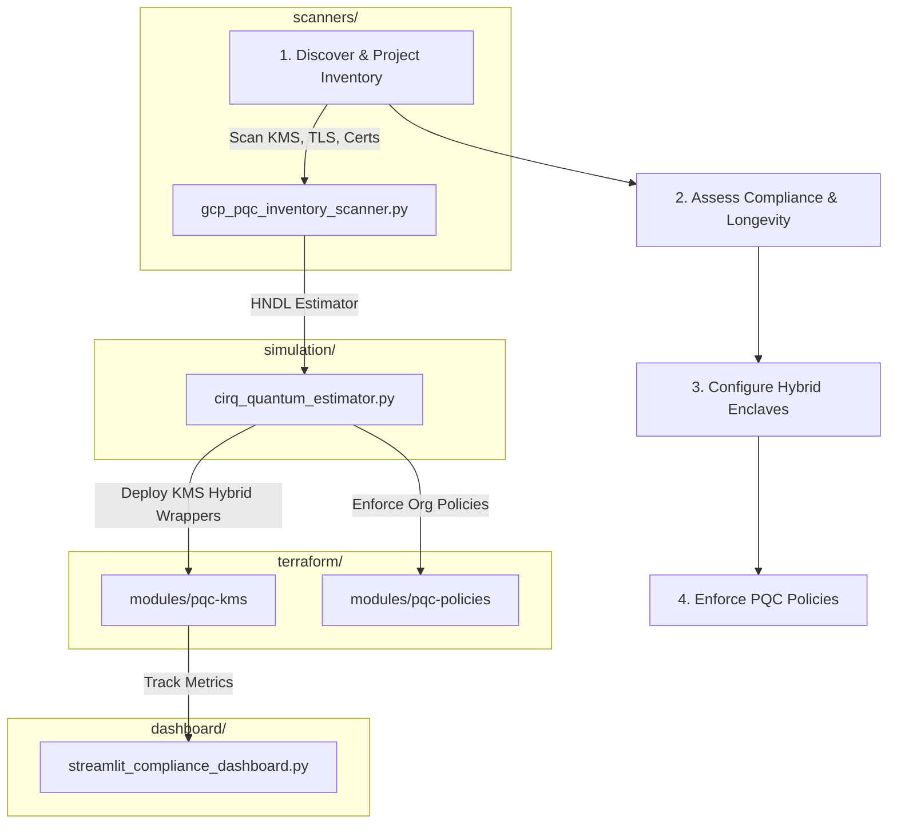

# GCP Post-Quantum Cryptography (PQC) Migration Toolkit

[](https://github.com/anandkrshnn-ai/gcp-pqc-migration-toolkit/actions/workflows/ci.yml)
[](requirements.txt)
[](terraform/)
[](LICENSE)

An assessment, inventory, and planning toolkit for GCP post-quantum migration. Focused on **Harvest Now, Decrypt Later (HNDL)** risk quantification and crypto-agility readiness because native Cloud KMS HSM PQC support is still limited.

This tool helps security and architecture teams discover legacy cryptography (RSA/ECC) usage on GCP, evaluate quantum risk exposure timelines, and plan mitigations using the software-defined hybrid patterns available today.

⭐ **Support the Project**: If you find this toolkit valuable for post-quantum planning, please star and fork the repository!

---

## 1. Capabilities

The GCP PQC Migration Toolkit helps security and platform teams inventory cryptographic assets on Google Cloud, assess post-quantum readiness, and plan concrete migration paths using **native GCP PQC primitives** and hybrid strategies.

### What it does today

- **PQC-aware crypto inventory**
  - Scans GCP projects for cryptographic resources (Cloud KMS keys, TLS endpoints, and related assets).
  - Classifies each asset as:
    - **Classical** (RSA, ECDSA, ECDH, etc.)
    - **Native PQC** (ML-DSA, ML-KEM, SLH-DSA, and other `PQ_*` algorithms supported by Cloud KMS and related services)
    - **Hybrid** (e.g., X25519 + ML-KEM / “X-Wing”-style configurations where available)

- **Migration path recommendations**
  - For classical assets, suggests concrete next steps aligned with current GCP capabilities, such as:
    - “Rotate this KMS key to `ML-DSA-65`”
    - “Enable hybrid X-Wing for this TLS path”
    - “Upgrade to PQC-capable certificate configuration in Certificate Manager”
  - Prioritizes actions using risk signals (data sensitivity, exposure, regulatory context).

- **PQC Maturity Score**
  - Computes a per-project **PQC Maturity Score**: the percentage of cryptographic assets already on native or hybrid PQC.
  - Provides a high-level view of readiness across projects and environments.

- **Compliance & planning artifacts**
  - Generates structured JSON reports suitable for:
    - Internal risk reviews
    - Architecture and migration planning
    - Auditor evidence (with upcoming CBOM export support)
  - Aligns with emerging standards and guidance (NIST PQC algorithms, EN 18031, NIS2-style cryptographic inventory expectations).

### GCP PQC primitives in scope

As of 2026, the toolkit assumes and leverages:

- **Cloud KMS**
  - Signature keys: `ML-DSA-*` (e.g., `ML-DSA-65`), `SLH-DSA-*`
  - KEM keys: `ML-KEM-*`
  - Hybrid configurations where supported (e.g., X25519 + ML-KEM / “X-Wing”-style)
- **TLS / Load Balancing / Certificate Manager**
  - PQC-capable certificate configurations and hybrid key exchange where available
- **Related GCP security services**
  - Integration points with Security Command Center, Asset Inventory, and policy controls (roadmap)

The toolkit is updated to reflect **native PQC support in GCP**, not just theoretical or hybrid-only scenarios.

---

## 2. What this Toolkit does NOT do

- **No Native Hardware PQC**: This toolkit **cannot** provision native post-quantum hardware-backed (HSM) keys in Cloud KMS, as the GCP platform does not natively support them.
- **No Auto-Remediation**: The scanner is read-only. It does **not** automatically migrate keys, rotate ciphers, or rewrite application code.
- **No Precise Timelines**: Qubit estimation is based on academic resource models. It does not predict exactly when a cryptanalytically useful quantum computer will be built.

---

## 3. Governance & Standards Alignment

| Algorithm Standard | NIST Reference | Recommended Timeline | Purpose | GCP Migration Strategy |
| :--- | :--- | :--- | :--- | :--- |
| **ML-KEM (FIPS 203)** | Kyber (768/1024) | 2030 | Key Encapsulation (KEM) | Software-based hybrid key wrapping models |
| **ML-DSA (FIPS 204)** | Dilithium | 2030 | Digital Signatures | GKE binary authorization and IAM validation gates |
| **SLH-DSA (FIPS 205)** | SPHINCS+ | 2033 | State-free Signatures | Root certificate signing and audit logging |

---

## 4. Quickstart Guide

### Setup
1. Clone the repository:
   ```bash
   git clone https://github.com/anandkrshnn-ai/gcp-pqc-migration-toolkit.git
   cd gcp-pqc-migration-toolkit
   ```
2. Install Python dependencies:
   ```bash
   pip install -e .
   ```

### 1. Run Inventory Compliance Assessment
Scan active GCP projects using Application Default Credentials (ADC), or run in simulated demo mode:
```bash
# Run real scan against a GCP project
gcp-pqc-scan --project YOUR_PROJECT_ID

# Run zero-credential demo simulation
gcp-pqc-scan --demo
```

### 2. Estimate HNDL Quantum Breach Risks
Analyze the logical/physical qubits required for RSA-2048:
```bash
python simulation/cirq_quantum_estimator.py --bits 2048 --data-longevity 10
```

### 3. Deploy PQC Dashboard
Start the local Streamlit visual tracking dashboard:
```bash
streamlit run dashboard/streamlit_compliance_dashboard.py
```

---

## 5. Security & IAM Considerations

The scanner runs with read-only permissions and does not modify resources. To scan a project, the executing credential (user or service account) requires:
- `cloudkms.viewer`
- `compute.viewer`
- `certificatemanager.viewer`

---

## 6. Future Roadmap

Aspirational stages for full automation:



---

## 7. Known Operational Limitations
For a detailed breakdown of GCP API limits, Cloud KMS PQC support statuses, and Shor algorithm simulation thresholds, refer to the [LIMITATIONS.md](LIMITATIONS.md) file at the root.
