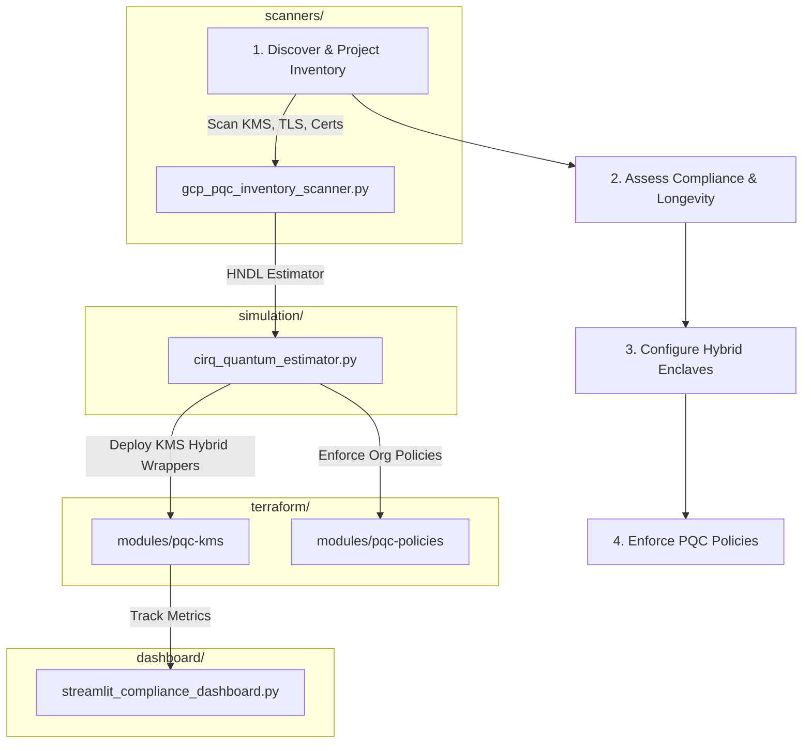

# GCP Post-Quantum Cryptography (PQC) Migration Toolkit

[](https://github.com/anandkrshnn-ai/gcp-pqc-migration-toolkit/actions/workflows/ci.yml)
[](requirements.txt)
[](terraform/)
[](LICENSE)

An assessment, inventory, and planning toolkit for GCP post-quantum migration. Focused on **Harvest Now, Decrypt Later (HNDL)** risk quantification and crypto-agility readiness because native Cloud KMS HSM PQC support is still limited.

This tool helps security and architecture teams discover legacy cryptography (RSA/ECC) usage on GCP, evaluate quantum risk exposure timelines, and plan mitigations using the software-defined hybrid patterns available today.

⭐ **Support the Project**: If you find this toolkit valuable for post-quantum planning, please star and fork the repository!

---

## 1. Core Features

- **PQC Inventory Scanner (MVP)**: A project-scoped resource scanner checking:
  - **Cloud KMS**: CryptoKeys using classical algorithms (RSA, ECDSA).
  - **Compute Engine**: SSL Policies allowing TLS versions < 1.3 or non-PQC friendly ciphers.
  - **Certificate Manager**: Certificates relying on classical asymmetric signatures.
- **Analytical HNDL Estimator**: Employs literature-backed estimates (e.g. Gidney & Ekerå 2021) to calculate physical and logical qubits under surface code, illustrating the quantum resources required to factor active keys.
- **Terraform Transition Enclaves**: Modules deploying classical key-wrapping enclaves (KEK wrappers for hybrid crypto-agility) and Organization Policy restrictions.
- **Readiness Dashboard**: A Streamlit dashboard to load and inspect scan reports, prioritize long-lived keys, and export markdown compliance reports.

---

## 2. What this Toolkit does NOT do

- **No Native Hardware PQC**: This toolkit **cannot** provision native post-quantum hardware-backed (HSM) keys in Cloud KMS, as the GCP platform does not natively support them.
- **No Auto-Remediation**: The scanner is read-only. It does **not** automatically migrate keys, rotate ciphers, or rewrite application code.
- **No Precise Timelines**: Qubit estimation is based on academic resource models. It does not predict exactly when a cryptanalytically useful quantum computer will be built.

---

## 3. Governance & Standards Alignment

| Algorithm Standard | NIST Reference | Recommended Timeline | Purpose | GCP Migration Strategy |
| :--- | :--- | :--- | :--- | :--- |
| **ML-KEM (FIPS 203)** | Kyber (768/1024) | 2030 | Key Encapsulation (KEM) | Software-based hybrid key wrapping models |
| **ML-DSA (FIPS 204)** | Dilithium | 2030 | Digital Signatures | GKE binary authorization and IAM validation gates |
| **SLH-DSA (FIPS 205)** | SPHINCS+ | 2033 | State-free Signatures | Root certificate signing and audit logging |

---

## 4. Quickstart Guide

### Setup
1. Clone the repository:
   ```bash
   git clone https://github.com/anandkrshnn-ai/gcp-pqc-migration-toolkit.git
   cd gcp-pqc-migration-toolkit
   ```
2. Install Python dependencies:
   ```bash
   pip install -e .
   ```

### 1. Run Inventory Compliance Assessment
Scan active GCP projects using Application Default Credentials (ADC), or run in simulated demo mode:
```bash
# Run real scan against a GCP project
gcp-pqc-scan --project YOUR_PROJECT_ID

# Run zero-credential demo simulation
gcp-pqc-scan --demo
```

### 2. Estimate HNDL Quantum Breach Risks
Analyze the logical/physical qubits required for RSA-2048:
```bash
python simulation/cirq_quantum_estimator.py --bits 2048 --data-longevity 10
```

### 3. Deploy PQC Dashboard
Start the local Streamlit visual tracking dashboard:
```bash
streamlit run dashboard/streamlit_compliance_dashboard.py
```

---

## 5. Security & IAM Considerations

The scanner runs with read-only permissions and does not modify resources. To scan a project, the executing credential (user or service account) requires:
- `cloudkms.viewer`
- `compute.viewer`
- `certificatemanager.viewer`

---

## 6. Future Roadmap

Aspirational stages for full automation:



---

## 7. Known Operational Limitations
For a detailed breakdown of GCP API limits, Cloud KMS PQC support statuses, and Shor algorithm simulation thresholds, refer to [docs/limitations.md](docs/limitations.md).
