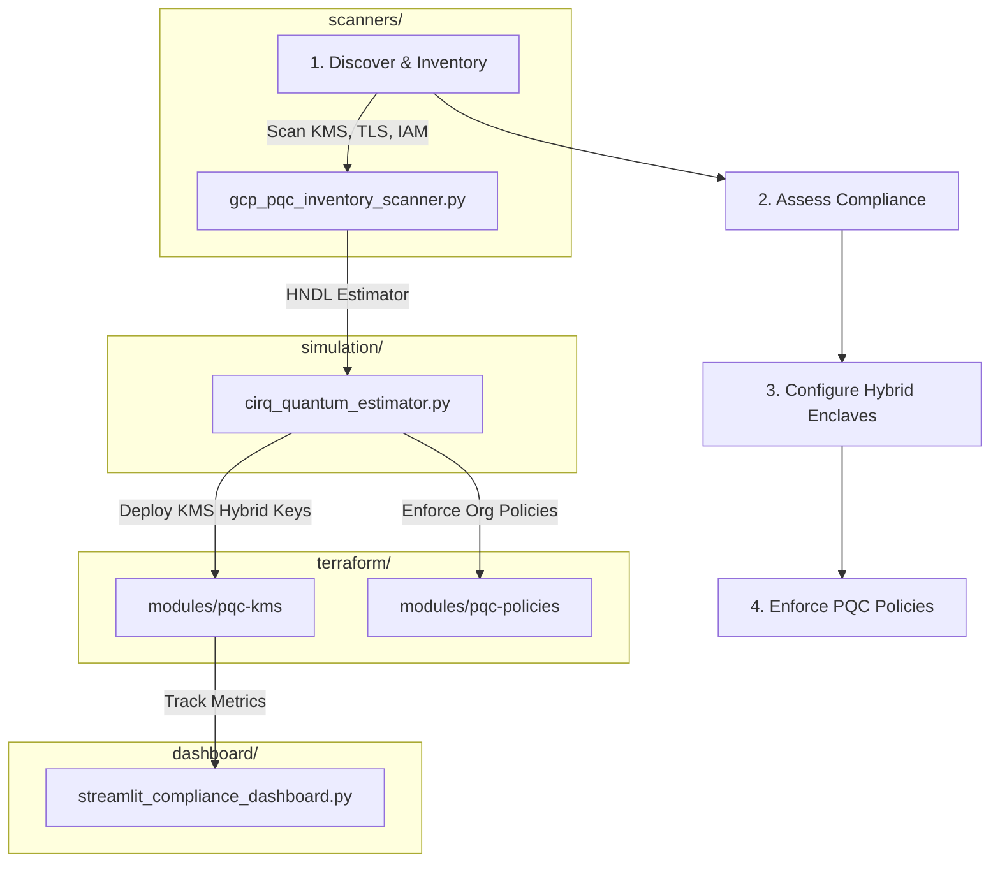

# GCP Post-Quantum Cryptography (PQC) Migration Toolkit

[](https://github.com/anandkrshnn-ai/gcp-pqc-migration-toolkit/actions/workflows/ci.yml)
[](requirements.txt)
[](terraform/)
[](LICENSE)

A production-quality toolkit helping enterprise security teams migrate from legacy classical cryptography (RSA/ECC) to NIST-standardized Post-Quantum Cryptography (PQC) on Google Cloud. Focuses on **Harvest Now, Decrypt Later (HNDL)** risk mitigations, crypto-agility audits, and transition orchestration.

⭐ **Support the Project**: If you find this toolkit valuable for post-quantum migrations, please star and fork the repository!

---

## 1. Architecture Overview

The migration lifecycle follows a four-stage process automated by this toolkit:



---

## 2. Core Features

- **PQC Inventory Scanner**: Evaluates GCP environments for algorithm compliance, flagging legacy SSL policies, non-hybrid Cloud KMS structures, and missing VPC Service Controls.
- **Shor Qubit Estimator**: Implements a physical qubit and gate-depth requirement estimator using `cirq` to trace when Shor's algorithm can crack active RSA/ECC assets based on simulated quantum hardware scaling.
- **IaC Hybrid Wrappers**: Terraform modules to provision Cloud KMS keyring enclaves and GCP Org Policies restricting classical cipher usage.
- **Compliance Dashboard**: Streamlit front-end displaying PQC readiness, HNDL risk indices, and migration milestones.

---

## 3. Governance & Standards Alignment

| Algorithm Standard | NIST Reference | Recommended Timeline | Purpose | GCP Migration Strategy |
| :--- | :--- | :--- | :--- | :--- |
| **ML-KEM (FIPS 203)** | Kyber (768/1024) | 2030 | Key Encapsulation (KEM) | Hybrid HSM-backed Cloud KMS wrapping models |
| **ML-DSA (FIPS 204)** | Dilithium | 2030 | Digital Signatures | GKE binary authorization and IAM validation gates |
| **SLH-DSA (FIPS 205)** | SPHINCS+ | 2033 | State-free Signatures | Root certificate signing and audit logging |

---

## 4. 5-Year Enterprise Migration Roadmap

| Phase | Timeframe | Goals | Key Actions | Deliverables |
| :--- | :--- | :--- | :--- | :--- |
| **Phase 1: Discovery** | Year 1 | Cryptographic Inventory | Audit all GCP services for legacy RSA/ECC ciphers | PQC compliance report |
| **Phase 2: Hybridization** | Year 2-3 | Hybrid wrapping models | Wrap active KMS databases with classical-quantum hybrids | Hybrid KMS key enclaves |
| **Phase 3: Sandbox** | Year 4 | Sandbox verification | Deploy GKE binary authorization with ML-DSA checks | Verified GKE gates |
| **Phase 4: Enforcement** | Year 5 | Strict Org Policies | Block classical algorithm fallback via organization controls | Locked Org Policies |

---

## 5. One-Click Verification Demo

Run the automated simulation script to execute the inventory assessment scan and quantum breach estimation calculations in one command:

```bash
chmod +x demo/run_demo.sh
./demo/run_demo.sh
```

---

## 6. Quickstart Guide

### Setup
1. Clone the repository:
   ```bash
   git clone https://github.com/anandkrshnn-ai/gcp-pqc-migration-toolkit.git
   cd gcp-pqc-migration-toolkit
   ```
2. Install Python dependencies:
   ```bash
   pip install -r requirements.txt
   ```

### 1. Run Inventory Compliance Assessment
Scan a simulated or active GCP target:
```bash
python scanners/gcp_pqc_inventory_scanner.py --max-log-lines 200
```

### 2. Estimate HNDL Quantum Breach Risks
Run the Shor gate-depth estimator for a 2048-bit RSA key:
```bash
python simulation/cirq_quantum_estimator.py --bits 2048
```

### 3. Deploy PQC Dashboard
Start the local Streamlit visual tracking dashboard:
```bash
streamlit run dashboard/streamlit_compliance_dashboard.py
```

---

## 7. Known Operational Limitations
For a detailed breakdown of GCP API limits, Cloud KMS PQC support statuses, and Shor algorithm simulation thresholds, refer to [docs/limitations.md](docs/limitations.md).

---

## 8. Connect & Collaborate
- **LinkedIn**: [Anandakrishnan](https://www.linkedin.com/in/anandkrshnn/)
- **PTV Bridge Integration**: For inquiries on integrating with post-quantum security enclaves, contact the maintainer.
